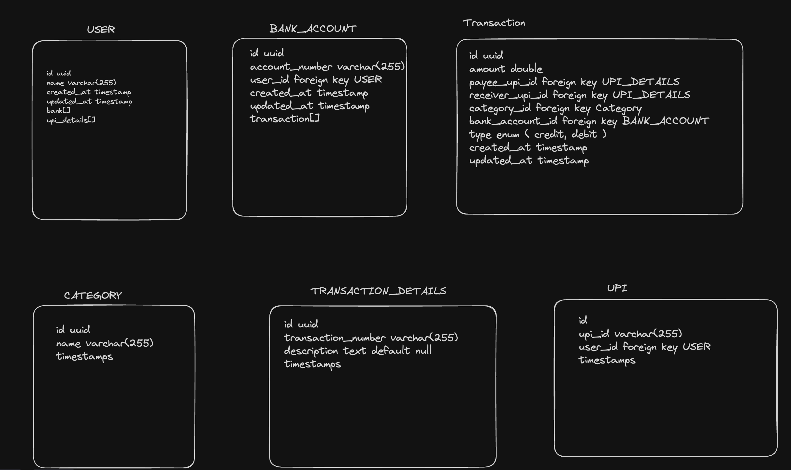

# Low Level Design according to requirement

## Functional Requirements

1. user should be able to set the email for which the emails will start coming in.
2. user should see all the transactions whenever a transaction is made either debit or credit.
3. user should see all the details of the transaction when clicked on it. for eg ( transaction type (credit/debit)
   to whom transaction is made, by whom transaction is made, amount, time and date, upi transaction number and UPI of other)
4. user should be able to give a category to each transaction.
5. user can filter all the transactions based on transaction type, categories, date and time, UPI id of other person.

