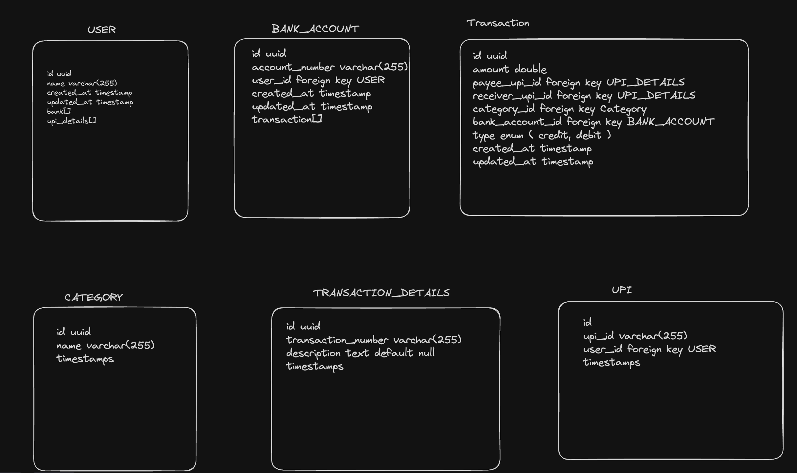

# Low Level Design according to requirement

## Functional Requirements

1. user signs in with google auth
2. user comes to the screen just a nomral screen empty screen.
3. button to add the email for the transaction.
4. clicks on the button, small popup shows, enter email.
5. user enters the email and as its saved, popup is closed and user is redirected to the transaction page where the last entered mail is active.
6. by default user is shown the transaction details for current day.
7. if no transactions, then empty will be shown.
8. user can select the dates for which the transactions have to be shown.
9. user can select a range of date. for eg. 2024/08/10 - 2024/08/22.
10. show in a manner of table or something like cards mentioned in design diagram.
11. when user clicks on the card, redirected to the /id of the transaction.
12. user can update the fields such as category, upi details
13. category such as fun, dairy, book, grocery etc.
14. upi details for eg user will see a upi id of the sender, then i can identify this id by name.
15. now both these can be filters to see the results if the user goes back after saving these details.
16. now if user goes back, and the user has already added the category and upi details of the transaction then user should see the name instead of the transaction.
17. if user clicks on the same transaction for which the user saved the metadetails, then there would be a option to edit the details too.



## API Endpoints

### Authentication

- **Endpoint:** `/api/v1/auth/sign_up`
- **Request Method:** `POST`
- **Description:** This endpoint is used for signing up and signing in the user.
- **Response:** Send the user info and set the access token in cookies and redirect the user to the main page.

### Bank Email

- **Endpoint:** `/api/v1/user/bank_email`
- **Request Method:** `POST`
- **Request Body:**

     ```json
     {
       "bank_emails": [
         "abc@mail.com",
         ...
       ]
     }
     ```

- **Description:** This endpoint allows the user to add one or more email addresses to monitor in the frontend.
- **Response:** Returns a `200 OK` status if successful, with appropriate error handling if an issue occurs.

### Get Bank Emails

- **Endpoint:** `/api/v1/user/bank_email`
- **Request Method:** `GET`
- **Description:** This endpoint retrieves all the email addresses that the user has added.
- **Response:** Returns an object containing an array of `bankemail` if successful.

### Update Bank Email

- **Endpoint:** `/api/v1/user/bank_email/:id`
- **Request Method:** `PUT`
- **Description:** This endpoint updates a specific email address that the user has added.
- **Response:** Returns a success response if the update is successful.

### Deactivate Bank Email

- **Endpoint:** `/api/v1/user/bank_email/:id`
- **Request Method:** `DELETE`

### Get Transactions

- **Endpoint:** `/api/v1/transactions`
- **Request Method:** `GET`
- **Request Query Params:**
  - `user_id=''`
  - `from=''`
  - `after=date`
  - `before=date`
  - `upi_id?=id`
  - `category?=''`
- **Description:** This endpoint retrieves all transactions for the current user associated with the specified bank email. By default, the transactions will be filtered for today and today +1 unless other dates are explicitly selected.
- **Response:** Returns all transactions matching the provided query parameters.

### Get Transaction Details

- **Endpoint:** `/api/v1/transactions/:id`
- **Request Method:** `GET`
- **Request Params:** `/transaction_id`
- **Description:** This endpoint retrieves the details of a specific transaction.
- **Response:** Returns the `Transaction` object with the details of the selected transaction.

### Update Transaction

- **Endpoint:** `/api/v1/transactions/:id`
- **Request Method:** `PUT`
- **Request Params:** `/transaction_id`
- **Request Body:**

     ```json
     { 
       "category": { "category updated" },
       "upi": { "Upi updated" } 
     }
     ```

- **Description:** This endpoint updates the category, UPI details, or both for a specific transaction.
- **Response:** Returns a success response if the transaction details are successfully updated.

## Migrations Commands

1. DB Table Migration

    ```bash
    npm run run_db_migration
    ```

2. Data Migrations

    ```bash
    npm run run_data_migration
    ```

3. Rollback DB Migrations

    ```bash
    npm run revert_db_migration
    ```

4. Rollback Data Migrations

    ```bash
    npm run revert_data_migration
    ```

5. Create DB Migration

   ```bash
    npm run create_migration db tablename
    ```

6. Create Data Migration

    ```bash
     npm run create_migration data tablename
     ```
